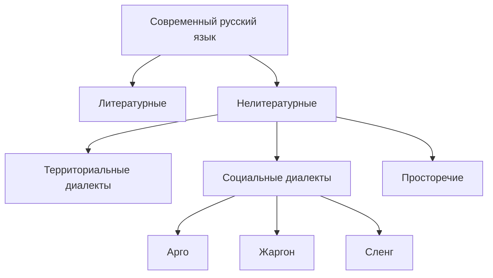

дата: 2026-09-11
тип: лекция
дисциплина: Деловое общение и культура речи
тема: Формы существования современного русского языка. Функциональные стили. Правила оформления курсовой/дипломной работы
tags:
  - деловое_общение
  - культура_речи
  - лекция
  - языкознание
---

# Лекция 1. Формы существования современного русского языка

> **Дисциплина:** Деловое общение и культура речи
> **Дата:** 11.09.2026
> **Тип:** Лекция

---

## 📌 Организационная часть

- **8 лекций** и **8 практик** за семестр
- **Для автомата нужно:**
    - участие в практических занятиях
    - можно пропустить **два занятия** по практике

---

## 📖 Введение

- Русский язык появился в **13–14 веке** — достаточно молодой по сравнению с китайским, японским, арабским.
- **Индоевропейский язык** — предположительно, предок русского языка.

---

## 🗂 Формы существования современного русского языка

### Нелитературные формы

| Форма | Характеристика |
|---|---|
| **Территориальные диалекты** | Местные разновидности языка |
| **Социальные диалекты** | Арго, жаргон, сленг — речь отдельных социальных групп |
| **Просторечие** | Характерно для малообразованных и необразованных горожан; грубые слова, нарушающие норму |

### Литературный язык

> **Литературный язык** — строго нормированная форма языка, существует в устной и письменной форме, закреплена в словарях и справочниках.

**Основные признаки литературного языка:**

- [ ] нормирование
- [ ] обработанность мастерами слова
- [ ] стилистическое многообразие
- [ ] относительная устойчивость
- [ ] многофункциональность (обслуживает все сферы общественной и культурной жизни нации)
- [ ] общеобязательность

---

## 🏠 Домашнее задание

> [!todo] Задание
> Выбрать **социальный жаргон** (не территориальный), выписать из него **15 слов** (например: медицинский, спортивный, игровой) и указать их значение.

---

## 🔗 Связанные заметки

- [[Деловое общение и культура речи]]
- [[Функциональные стили речи]]
- [[Правила оформления курсовой работы]]
